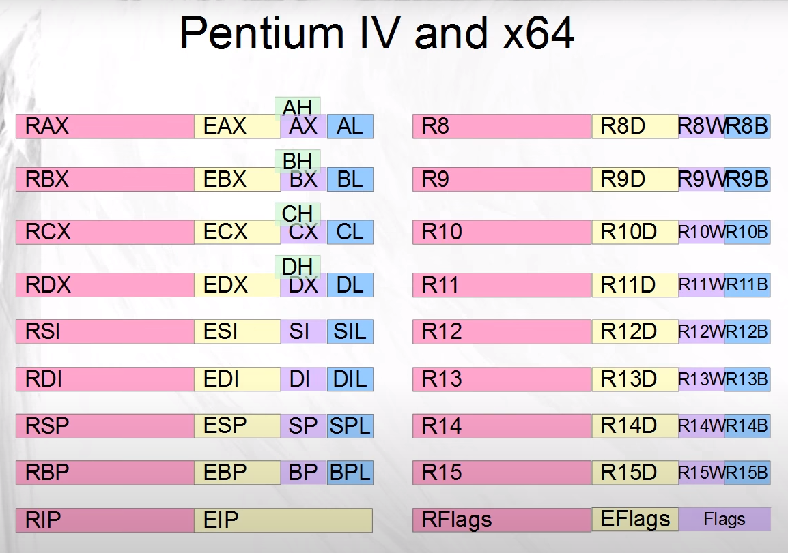
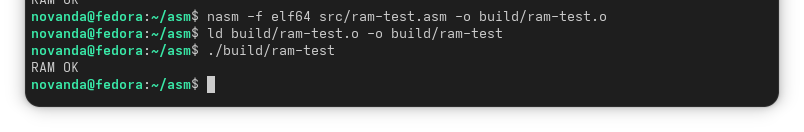

The file names are self‑explanatory and reflect the functionality of each program. The structure and flow of these assembly codes are inspired by the Introduction to x86 Microprocessor course I took at IUST University. While the course focused on the 8086 (16‑bit assembly), the examples in this repository are implemented using x86‑64 assembly.

the src directory contains .asm files(64-bit assembly). 
the build directory contains executed files using the following commands _for **linux**:

**Assemble** using **nasm** :
```
nasm -f elf64 src/---.asm -o build/---.o
```
link the object file:
```
ld build/---.o -o /build/---   
```
Run:
```
build/---
```

the registers layout in x86-64 are as follow


[read_key](src/read_key.asm) assembly code for the algorithm below is here
```
#read key
#   ↓
#is key ESC?
#   ↓ yes → exit
#   ↓ no
#print character
#   ↓
#repeat
```
[BCDTOBINARY](src/BCD2B.asm) this scrpit will convert 4 digit bcd into binary

[RAM_TEST](src/ram-test.asm)---|



[Hello world!](src/hello.asm) Hello, World! on sreen

